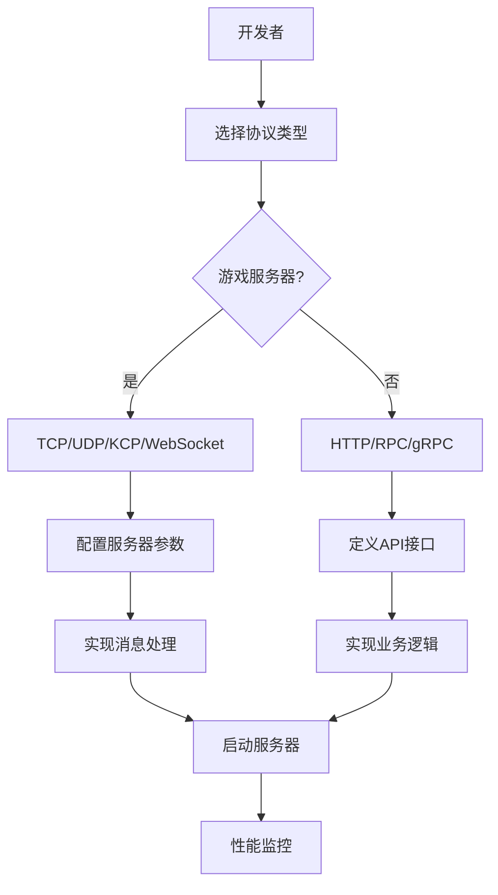

# NetCore-Go 高性能网络库产品需求文档

## 1. 产品概述

NetCore-Go 是一个专为游戏服务器和Web后端开发设计的高性能Golang网络库，提供统一的接口抽象和多协议支持。
- 解决游戏服务器和Web后端开发中网络通信的复杂性和性能问题，为开发者提供简洁优雅的API接口和高性能的底层实现。
- 目标成为Golang生态中最优秀的网络库之一，支持大规模并发连接和低延迟通信需求。

## 2. 核心功能

### 2.1 用户角色

| 角色 | 使用方式 | 核心权限 |
|------|----------|----------|
| 游戏服务器开发者 | 导入库并配置游戏协议 | 可使用TCP、UDP、KCP、WebSocket等实时通信协议 |
| Web后端开发者 | 导入库并配置Web服务 | 可使用HTTP、RPC、gRPC等请求响应协议 |
| 库维护者 | 源码开发和维护 | 可修改核心代码、发布版本、管理文档 |

### 2.2 功能模块

我们的网络库需求包含以下主要模块：
1. **核心抽象层**：统一的连接管理、消息处理、事件驱动架构
2. **协议实现层**：TCP、UDP、KCP、WebSocket、HTTP、RPC、RPCX、gRPC协议支持
3. **性能优化层**：连接池、内存池、协程池、负载均衡
4. **扩展功能层**：长轮询、心跳检测、重连机制、消息队列
5. **测试基准层**：各协议性能测试、压力测试、基准对比
6. **文档示例层**：API文档、使用示例、最佳实践指南

### 2.3 页面详情

| 模块名称 | 子模块名称 | 功能描述 |
|----------|------------|----------|
| 核心抽象层 | 连接管理器 | 统一管理各种协议连接，提供连接生命周期管理、连接池复用 |
| 核心抽象层 | 消息处理器 | 定义统一的消息编解码接口，支持自定义协议格式 |
| 核心抽象层 | 事件系统 | 基于观察者模式的事件驱动架构，支持连接事件、消息事件 |
| 协议实现层 | TCP服务器 | 高性能TCP服务器实现，支持多路复用、非阻塞IO |
| 协议实现层 | UDP服务器 | 高性能UDP服务器实现，支持广播、组播功能 |
| 协议实现层 | KCP协议 | 基于UDP的可靠传输协议，适用于游戏实时通信 |
| 协议实现层 | WebSocket服务器 | 支持WebSocket协议，兼容浏览器客户端 |
| 协议实现层 | HTTP服务器 | 高性能HTTP服务器，支持RESTful API |
| 协议实现层 | RPC框架 | 自定义RPC协议实现，支持同步异步调用 |
| 协议实现层 | RPCX集成 | 集成RPCX微服务框架，支持服务发现 |
| 协议实现层 | gRPC集成 | 集成gRPC协议，支持Protocol Buffers |
| 性能优化层 | 连接池管理 | 实现连接池复用，减少连接创建销毁开销 |
| 性能优化层 | 内存池管理 | 实现内存池复用，减少GC压力 |
| 性能优化层 | 协程池管理 | 实现协程池复用，控制并发数量 |
| 性能优化层 | 负载均衡 | 支持多种负载均衡算法，分发请求到后端服务 |
| 扩展功能层 | 长轮询支持 | 实现HTTP长轮询机制，支持实时推送 |
| 扩展功能层 | 心跳检测 | 实现连接心跳检测，及时发现断线连接 |
| 扩展功能层 | 重连机制 | 实现客户端自动重连，提高连接稳定性 |
| 扩展功能层 | 消息队列 | 集成消息队列支持，实现异步消息处理 |
| 测试基准层 | 性能测试 | 各协议吞吐量、延迟、并发连接数测试 |
| 测试基准层 | 压力测试 | 极限负载下的稳定性和性能表现测试 |
| 测试基准层 | 基准对比 | 与其他网络库的性能对比分析 |
| 文档示例层 | API文档 | 完整的API接口文档和参数说明 |
| 文档示例层 | 使用示例 | 各种使用场景的代码示例 |
| 文档示例层 | 最佳实践 | 性能优化和架构设计的最佳实践指南 |

## 3. 核心流程

### 游戏服务器开发者流程
1. 导入NetCore-Go库
2. 选择适合的协议（TCP/UDP/KCP/WebSocket）
3. 配置服务器参数（端口、缓冲区大小等）
4. 实现消息处理逻辑
5. 启动服务器并处理客户端连接
6. 监控性能指标和连接状态

### Web后端开发者流程
1. 导入NetCore-Go库
2. 选择适合的协议（HTTP/RPC/gRPC）
3. 定义API接口和数据结构
4. 实现业务逻辑处理
5. 配置中间件（认证、限流等）
6. 部署服务并进行负载测试

## 4. 用户界面设计

### 4.1 设计风格
- 主色调：深蓝色 (#1e3a8a) 和绿色 (#10b981) 体现技术专业性
- 代码风格：简洁的API设计，链式调用支持
- 字体：等宽字体用于代码示例，无衬线字体用于文档
- 布局风格：模块化设计，清晰的层次结构
- 图标风格：简约的线性图标，体现高性能和稳定性

### 4.2 API设计概览

| 模块名称 | 接口名称 | 设计元素 |
|----------|----------|----------|
| 核心抽象层 | Server接口 | 统一的服务器启动、停止、配置接口，支持链式调用 |
| 协议实现层 | Protocol接口 | 各协议的统一抽象，包含连接、消息处理方法 |
| 性能优化层 | Pool接口 | 连接池、内存池、协程池的统一管理接口 |
| 扩展功能层 | Middleware接口 | 中间件系统，支持插件式扩展 |
| 测试基准层 | Benchmark工具 | 命令行工具，支持各种测试场景配置 |
| 文档示例层 | Example代码 | 清晰的代码示例，包含注释和最佳实践 |

### 4.3 响应式设计

该网络库主要面向服务器端开发，不涉及前端界面。重点关注API设计的易用性和文档的可读性，确保在不同开发环境下都能提供良好的开发体验。