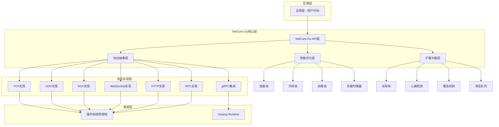
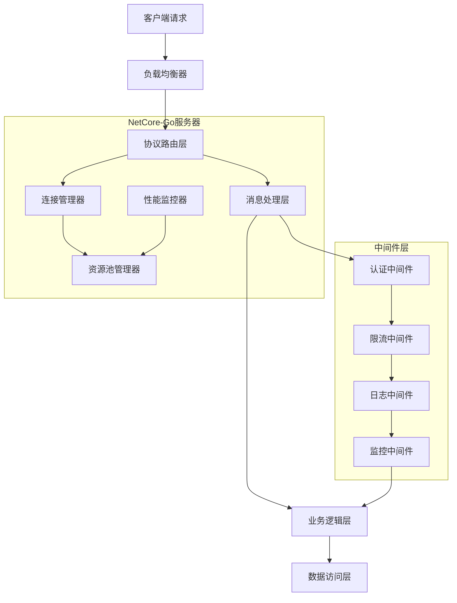
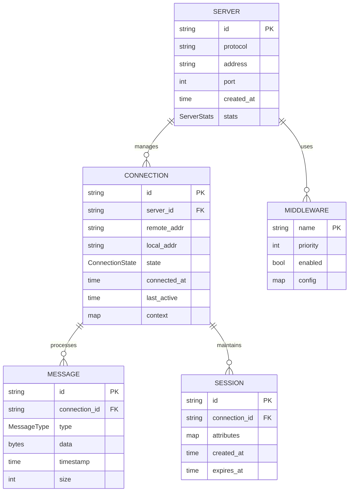

# NetCore-Go 高性能网络库技术架构文档

## 1. 架构设计



## 2. 技术描述

* Frontend: 无（服务器端库）

* Backend: Go\@1.21+ + 高性能网络库实现

* 核心依赖:

  * golang.org/x/net（网络扩展包）

  * github.com/xtaci/kcp-go（KCP协议）

  * github.com/gorilla/websocket（WebSocket）

  * google.golang.org/grpc（gRPC）

  * github.com/smallnest/rpcx（RPCX框架）

  * github.com/valyala/fasthttp（高性能HTTP）

## 3. API定义

### 3.1 核心接口

#### 服务器接口

```go
type Server interface {
    Start(addr string) error
    Stop() error
    SetHandler(handler MessageHandler)
    SetMiddleware(middleware ...Middleware)
    GetStats() *ServerStats
}
```

#### 连接接口

```go
type Connection interface {
    ID() string
    RemoteAddr() net.Addr
    LocalAddr() net.Addr
    Send(data []byte) error
    SendMessage(msg Message) error
    Close() error
    IsActive() bool
    SetContext(key, value interface{})
    GetContext(key interface{}) interface{}
}
```

#### 消息处理接口

```go
type MessageHandler interface {
    OnConnect(conn Connection)
    OnMessage(conn Connection, msg Message)
    OnDisconnect(conn Connection, err error)
}
```

### 3.2 协议特定API

#### TCP服务器创建

```go
func NewTCPServer(opts ...ServerOption) Server
```

参数:

| 参数名称 | 参数类型         | 是否必需  | 描述      |
| ---- | ------------ | ----- | ------- |
| opts | ServerOption | false | 服务器配置选项 |

响应:

| 参数名称   | 参数类型   | 描述       |
| ------ | ------ | -------- |
| server | Server | TCP服务器实例 |

示例:

```go
server := netcore.NewTCPServer(
    netcore.WithReadBufferSize(4096),
    netcore.WithWriteBufferSize(4096),
    netcore.WithMaxConnections(10000),
)
```

#### UDP服务器创建

```go
func NewUDPServer(opts ...ServerOption) Server
```

#### WebSocket服务器创建

```go
func NewWebSocketServer(opts ...ServerOption) Server
```

#### HTTP服务器创建

```go
func NewHTTPServer(opts ...ServerOption) Server
```

#### RPC服务器创建

```go
func NewRPCServer(opts ...ServerOption) Server
```

### 3.3 性能优化API

#### 连接池配置

```go
type PoolConfig struct {
    InitialSize int
    MaxSize     int
    IdleTimeout time.Duration
}

func WithConnectionPool(config PoolConfig) ServerOption
```

#### 内存池配置

```go
func WithMemoryPool(bufferSize int, poolSize int) ServerOption
```

## 4. 服务器架构图



## 5. 数据模型

### 5.1 数据模型定义



### 5.2 数据结构定义

#### 服务器统计信息

```go
type ServerStats struct {
    ActiveConnections   int64     `json:"active_connections"`
    TotalConnections    int64     `json:"total_connections"`
    MessagesReceived    int64     `json:"messages_received"`
    MessagesSent        int64     `json:"messages_sent"`
    BytesReceived       int64     `json:"bytes_received"`
    BytesSent           int64     `json:"bytes_sent"`
    StartTime           time.Time `json:"start_time"`
    Uptime              int64     `json:"uptime_seconds"`
    ErrorCount          int64     `json:"error_count"`
    LastError           string    `json:"last_error"`
}
```

#### 连接状态枚举

```go
type ConnectionState int

const (
    StateConnecting ConnectionState = iota
    StateConnected
    StateDisconnecting
    StateDisconnected
    StateError
)
```

#### 消息类型定义

```go
type MessageType int

const (
    MessageTypeText MessageType = iota
    MessageTypeBinary
    MessageTypeJSON
    MessageTypeProtobuf
    MessageTypeCustom
)

type Message struct {
    Type      MessageType `json:"type"`
    Data      []byte      `json:"data"`
    Timestamp time.Time   `json:"timestamp"`
    Headers   map[string]string `json:"headers,omitempty"`
}
```

#### 服务器配置选项

```go
type ServerConfig struct {
    // 网络配置
    ReadBufferSize    int           `json:"read_buffer_size"`
    WriteBufferSize   int           `json:"write_buffer_size"`
    MaxConnections    int           `json:"max_connections"`
    ReadTimeout       time.Duration `json:"read_timeout"`
    WriteTimeout      time.Duration `json:"write_timeout"`
    IdleTimeout       time.Duration `json:"idle_timeout"`
    
    // 性能配置
    EnableConnectionPool bool `json:"enable_connection_pool"`
    EnableMemoryPool     bool `json:"enable_memory_pool"`
    EnableGoroutinePool  bool `json:"enable_goroutine_pool"`
    
    // 功能配置
    EnableHeartbeat      bool          `json:"enable_heartbeat"`
    HeartbeatInterval    time.Duration `json:"heartbeat_interval"`
    EnableReconnect      bool          `json:"enable_reconnect"`
    MaxReconnectAttempts int           `json:"max_reconnect_attempts"`
    
    // 监控配置
    EnableMetrics        bool   `json:"enable_metrics"`
    MetricsPath          string `json:"metrics_path"`
    EnablePprof          bool   `json:"enable_pprof"`
}
```

#### 中间件接口

```go
type Middleware interface {
    Name() string
    Priority() int
    Process(ctx Context, next Handler) error
}

type Context interface {
    Connection() Connection
    Message() Message
    Set(key string, value interface{})
    Get(key string) (interface{}, bool)
    Abort()
    IsAborted() bool
}
```

#### 负载均衡器配置

```go
type LoadBalancerConfig struct {
    Algorithm    LoadBalanceAlgorithm `json:"algorithm"`
    HealthCheck  HealthCheckConfig    `json:"health_check"`
    Backends     []BackendConfig      `json:"backends"`
}

type LoadBalanceAlgorithm int

const (
    RoundRobin LoadBalanceAlgorithm = iota
    WeightedRoundRobin
    LeastConnections
    IPHash
    Random
)

type BackendConfig struct {
    Address string `json:"address"`
    Weight  int    `json:"weight"`
    Enabled bool   `json:"enabled"`
}
```

